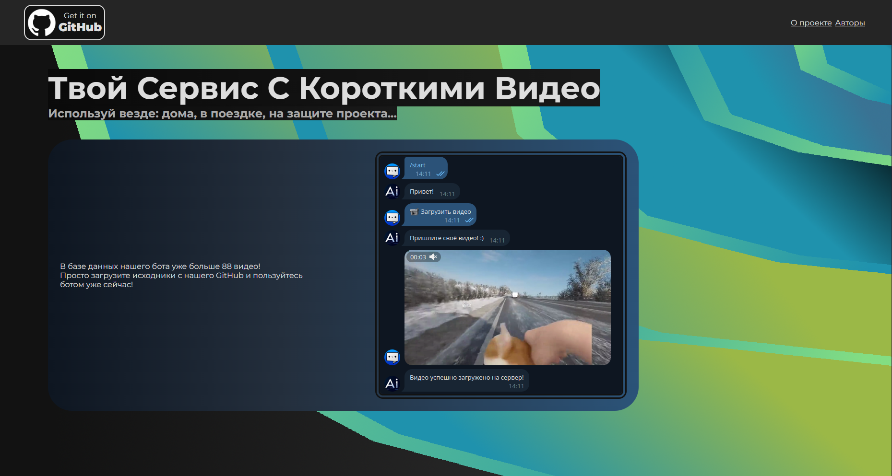

# Техническое задание

1. Project Name: Video Hoster
2. Authors:
   - Team Lead: Чагаев Егор Алексеевич.
   - Project Developers: Чагаев Егор Алексеевич (пока я один)
   - Teacher: Анатольев Алексей Владимирович
3. Description of the program.
   Проект представляет собой телеграмм-бота и сервер с информацией о нём. Данный проект поможет пользователям телеграмм с поиском смешных видео и их дальнейшим распространением среди своих друзей.
   - Бот
    >- Бот запускается в файле "/bot/main.py". Запуск бота можно осуществить с помощью скрипта "start.sh", находящимся в той же директории;
    >- Бот получает команду "/start" от пользователя и запускается метод приветствия собеседника, который в дальнейшем запускает метод меню;
    >- Из меню пользователь может начать смотреть видео или загружать их;
    >- При выборе опции "смотреть видео" для пользователя составляется очередь из видео. Из этой очереди по порядку выводятся все видео;
    >- Загрузить можно одно или несколько видео сразу;
    >- Для использования бота понадобится ваш id в телеграмм;
    >- В процессе работы бота он будет сохранять видео;
   - Сервер и html-документ
    >- Аналогично запуску бота, сервер запускактся в файле "/site/main.py". Сервер также можно запустить через скрипт "start.sh";
    >- Для сайта понадобятся 3 страницы: корневая, страница с информацией, страница с информацией об авторах.
    >- Для корневой страницы нужно будет использовать заголовок, основной блок текста и картинку.
4. Project Description.
    - Структура проекта:
   > - Готовый проект запускается из файла "main.py" или "main.exe";
   > - Импортируем все нужные нам классы и функции из /data/;
   > - [Схема работы](https://miro.com/app/board/uXjVIcKErGk=/?share_link_id=192393488939).
5. Program code plan.
    - Функции и декораторы:
   > main(), log_dialog(), log_all(), make_queue(), user_table_exists(), create_user_table(), update_user_table(), refactor_result();
    - Классы:
   > VideoHoster;
    - Библиотеки:
   > pyTelegramBotAPI, Flask, dotenv;
6. Graphical interface.
    
7. Deadlines.

   | Задача                                     | Дедлайн         |
   |--------------------------------------------|-----------------|
   | Создание команд, описание проекта          | 2 марта 23:59   |
   | Задание ТЗ (technical_specification.md)    | 9 марта 23:59   |
   | Часть задания сделана                      | 16 марта 23:59  |
   | Работающая часть проекта                   | 23 марта 23:59  |
   | Черновик пояснительной записки (README.md) | 30 марта 23:59  |
   | Презентация. Почти всё работает            | 13 апреля 23:59 |
   | Всё готово к вечеру перед защитой          | 23 апреля 23:59 |
   | Защита                                     | 24 апреля       |
